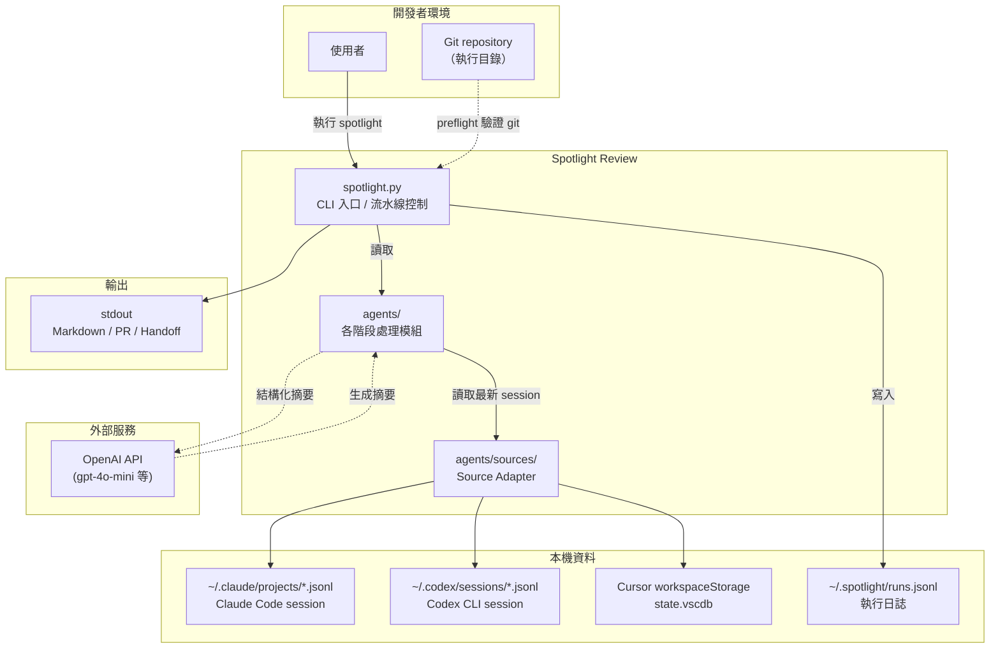
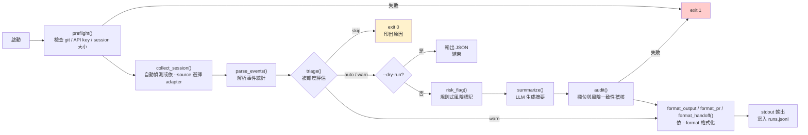
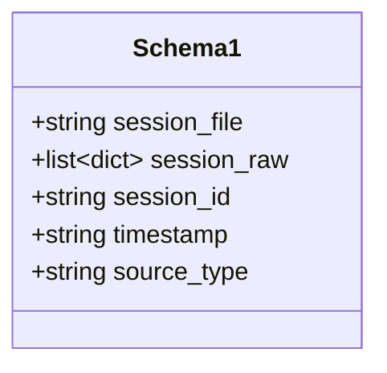
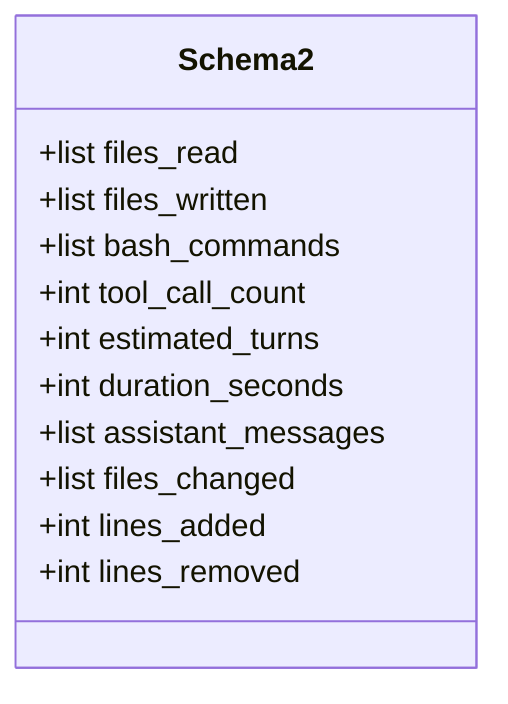
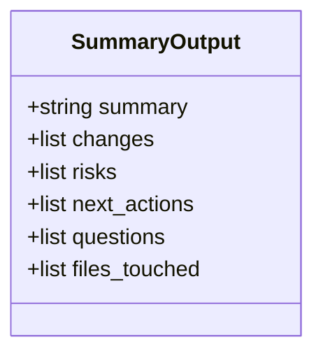
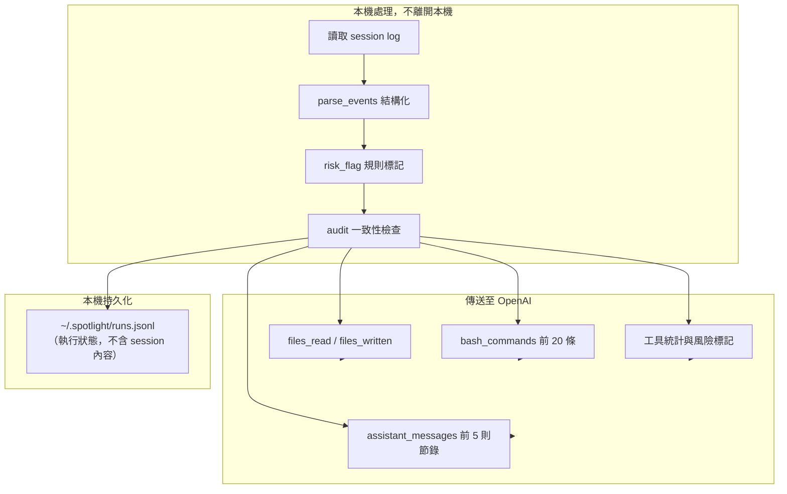

# Spotlight Review — System Map

## Purpose

Spotlight Review 是一個 CLI 工具，用於把 AI coding agent（Claude Code / Codex CLI / Cursor）的 session log 轉換成可審計的繁中交接報告。它強調「session 內容盡量留在本機」，只把結構化摘要送到 LLM 進行生成。

---

## System Context



---

## Pipeline Data Flow



---

## Component Breakdown

| 元件 | 檔案 | 職責 |
|------|------|------|
| CLI 入口與控制 | `spotlight.py` | 解析 CLI 參數、載入 config、協調流水線、記錄執行狀態 |
| 啟動護欄 | `agents/preflight.py` | 確認在 git repo 內、OPENAI_API_KEY 存在、session 檔案與大小限制 |
| Session 收集器 | `agents/collect_session.py` | 自動偵測來源或依設定分派對應 adapter |
| Source Adapter 介面 | `agents/sources/base.py` | 定義統一 adapter 介面與 Schema 1 輸出 |
| Claude Code Adapter | `agents/sources/claude_code.py` | 讀取 `~/.claude/projects/**/*.jsonl` |
| Codex CLI Adapter | `agents/sources/codex_cli.py` | 讀取 `~/.codex/sessions/**/*.jsonl` |
| Cursor Adapter | `agents/sources/cursor.py` | 讀取 Cursor `state.vscdb` 中的 composer data |
| 事件解析 | `agents/parse_events.py` | 把 Schema 1 轉成 Schema 2：檔案讀寫、bash 指令、統計、風險輸入 |
| 複雜度分類 | `agents/triage.py` | 依檔案數、行數、lockfile、migration/schema 給出 auto/warn/skip 建議 |
| 風險標記 | `agents/risk_flag.py` | 規則式掃描敏感路徑、破壞性指令、權限提升、範圍外存取 |
| LLM 摘要 | `agents/summarize.py` | 把解析結果與風險標記送入 OpenAI，產生 JSON 摘要 |
| 摘要稽核 | `agents/audit.py` | 驗證必填欄位、比對 files_touched 與實際檔案、確認 high risk 有風險描述 |
| 格式化輸出 | `agents/format.py` | 輸出 markdown / pr / handoff 三種格式 |
| 執行日誌 | `agents/logger.py` | 寫入與讀取 `~/.spotlight/runs.jsonl`，支援 `--stats` |
| Legacy（已不使用）| `agents/collect.py` / `agents/parse.py` | 早期基於 git diff 的收集與解析 |

---

## Data Schema 對照

### Schema 1：Source Adapter 輸出（`BaseSourceAdapter.collect`）



### Schema 2：parse_events 輸出



### summarize 輸出（LLM JSON）



---

## File Map

```
spotlight-review/
├── spotlight.py              # CLI 入口 / 流水線控制
├── spotlight.config.yaml     # 設定檔
├── requirements.txt          # Python 相依
├── install.sh                # 一鍵安裝腳本
├── system-map.md             # 本文檔
├── spec.md                   # 技術規格書
├── agents/
│   ├── sources/              # Source adapter
│   │   ├── base.py
│   │   ├── claude_code.py
│   │   ├── codex_cli.py
│   │   └── cursor.py
│   ├── collect_session.py    # 來源分發器
│   ├── parse_events.py       # 事件解析
│   ├── risk_flag.py          # 規則式風險標記
│   ├── summarize.py          # LLM 摘要
│   ├── audit.py              # 摘要稽核
│   ├── format.py             # 輸出格式化
│   ├── preflight.py          # 啟動護欄
│   ├── triage.py             # 複雜度評估
│   ├── logger.py             # 執行日誌
│   ├── collect.py            # (legacy) git diff 收集
│   └── parse.py              # (legacy) diff 解析
├── tests/                    # 單元測試
└── fixtures/                 # 測試用 session 資料
```

---

## External Dependencies

| 相依 | 用途 |
|------|------|
| `openai` | 呼叫 OpenAI Chat Completions API |
| `pyyaml` | 讀取 `spotlight.config.yaml` |
| `git`（系統指令）| `preflight` 驗證是否在 git repository 內 |
| `python` ≥ 3.10 | 使用 `list[dict]`、`dict \| None` 等語法 |

---

## Trust Boundary



> 注意：Spotlight **不會主動遮罩 credential、token 或密碼**。建議先用 `--dry-run` 確認會送往 LLM 的內容。
